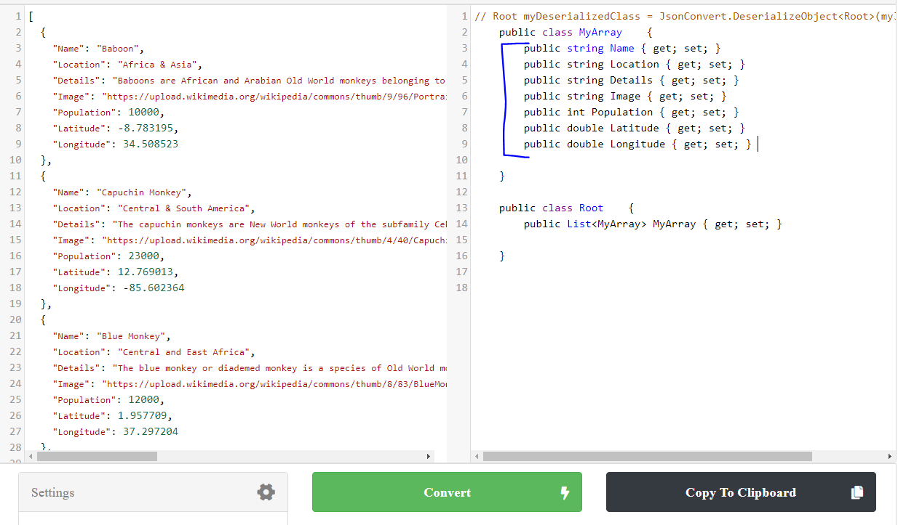

## 实验一: 显示数据

在实验准备部分，各位小伙伴对 .NET MAUI 项目的组成有了初步的了解，现在让我们开始进入编码，看看如何在列表中显示数据列表。

### 在 Visual Studio 中打开解决方案

1. 打开**Part 1 - Displaying Data/MonkeyFinder.sln**

此 MonkeyFinder 包含 1 个项目：

* MonkeyFinder 项目 - 基于 .NET MAUI 针对 Android、iOS、macOS 和 Windows 的跨平台应用开发的主要项目。 它包括应用程序开发所需要的所有部分（ Models 、 Views 、ViewModels 和 Services ）。


**MonkeyFinder 项目**也包括了我们将在动手实验期间使用的空白代码文件和 XAML 页面文件。 实验过程中，我们都通过该项目去添加和修改相关代码。

### 还原 NuGet 包

实验中所有项目都已设置好所需的 NuGet 包，因此在动手实验室期间无需安装其他包。 我们必须做的第一件事是通过网络中恢复所有 NuGet 包。

1. **右键单击** **Solution** 并选择 **Restore NuGet packages...**


### 创建 Model

我们将下载有关猴子的详细信息，并且需要一个类来表示它。



我们可以使用 [json2csharp.com](https://json2csharp.com) 轻松转换位于 [montemagno.com/monkeys.json](https://montemagno.com/monkeys.json) 的 json 文件，并粘贴将原始 json 转换为 quicktype 以生成我们的 C# 类。 确保将类的名字设置为“Monkey”，将生成的命名空间名字设置为“MonkeyFinder.Model”，然后选择 C#。

1. 打开 `Model/Monkey.cs`
2. 在 `Monkey.cs`, 复制黏贴一下代码:

```csharp
public class Monkey
{        
    public string Name { get; set; } 
    public string Location { get; set; } 
    public string Details { get; set; } 
    public string Image { get; set; } 
    public int Population { get; set; } 
    public double Latitude { get; set; } 
    public double Longitude { get; set; } 
}
```

### 显示数据

我们可以在 `MainPage.xaml` 的 `CollectionView` 中显示任何数据类型的硬编码数据。 这将允许我们通过使用一些简单的图像和标签设置 `ItemTemplate` 来创建我们的用户界面。

我们首先需要在 `MainPage.xaml` 的顶部添加一个新的命名空间：

```xml
xmlns:model="clr-namespace:MonkeyFinder.Model"
```

这将允许我们引用上面的 Monkey 类来进行数据绑定。

将以下内容添加到 MainPage.xaml 的 `ContentPage` 中：


```xml
<CollectionView>
    <CollectionView.ItemsSource>
        <x:Array Type="{x:Type model:Monkey}">
            <model:Monkey
                Name="Baboon"
                Image="https://raw.githubusercontent.com/jamesmontemagno/app-monkeys/master/baboon.jpg"
                Location="Africa and Asia" />
            <model:Monkey
                Name="Capuchin Monkey"
                Image="https://raw.githubusercontent.com/jamesmontemagno/app-monkeys/master/capuchin.jpg"
                Location="Central and South America" />
            <model:Monkey
                Name="Red-shanked douc"
                Image="https://raw.githubusercontent.com/jamesmontemagno/app-monkeys/master/douc.jpg"
                Location="Vietnam" />
        </x:Array>
    </CollectionView.ItemsSource>
    <CollectionView.ItemTemplate>
        <DataTemplate x:DataType="model:Monkey">
            <HorizontalStackLayout Padding="10">
                <Image
                    Aspect="AspectFill"
                    HeightRequest="100"
                    Source="{Binding Image}"
                    WidthRequest="100" />
                <Label VerticalOptions="Center" TextColor="Gray">
                    <Label.Text>
                        <MultiBinding StringFormat="{}{0} | {1}">
                            <Binding Path="Name" />
                            <Binding Path="Location" />
                        </MultiBinding>
                    </Label.Text>
                </Label>
            </HorizontalStackLayout>
        </DataTemplate>
    </CollectionView.ItemTemplate>
</CollectionView>
```

如果我们想将两个字符串垂直叠加显示，我们可以将两个 `Label` 控件包装在 `Vertical StackLayout` 中，并指定字体大小以突出显示：

```xml
 <HorizontalStackLayout Padding="10">
    <Image
        Aspect="AspectFill"
        HeightRequest="100"
        Source="{Binding Image}"
        WidthRequest="100" />
    <VerticalStackLayout VerticalOptions="Center">
        <Label Text="{Binding Name}" FontSize="24" TextColor="Gray"/>
        <Label Text="{Binding Location}" FontSize="18" TextColor="Gray"/>
    </VerticalStackLayout>
</HorizontalStackLayout>
```

### 运行应用程序

确保您的机器设置可以部署和在不同平台中调试：

* [有关 Android 模拟器设置步骤](https://docs.microsoft.com/dotnet/maui/android/emulator/device-manager)
* [在 Windows 下使用 .NET MAUI 开发的设置](https://docs.microsoft.com/dotnet/maui/windows/setup)

1. 在 Visual Studio 中，通过选择调试菜单中的下拉菜单并更改 “Framework”，将 Android 或 Windows 应用程序设置为启动项目


2. 在 Visual Studio 中，单击“调试”按钮或工具 -> 开始调试
     - 如果您遇到任何问题，请参阅运行时平台的设置指南

运行该应用程序将生成三只猴子的列表：


让我们继续学习在 [实验二 - MVVM 和数据绑定](../Part%202%20-%20MVVM/README.md) 中使用数据绑定的 MVVM 模式